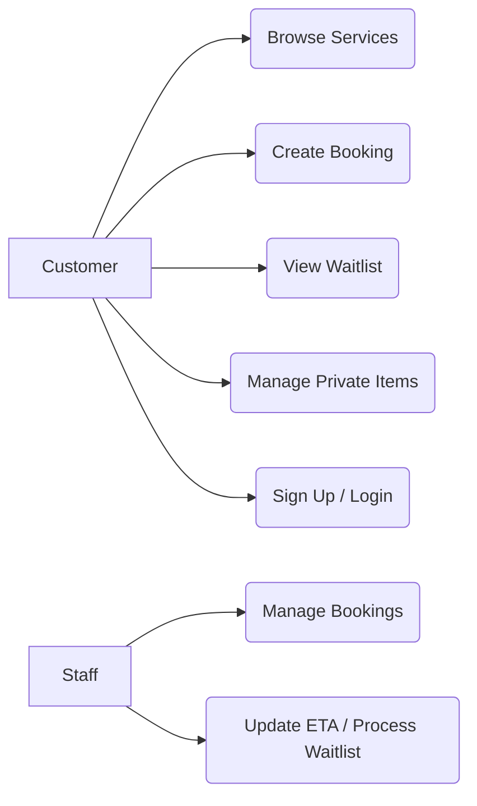
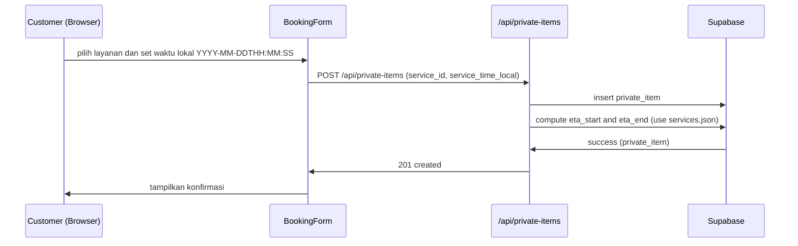
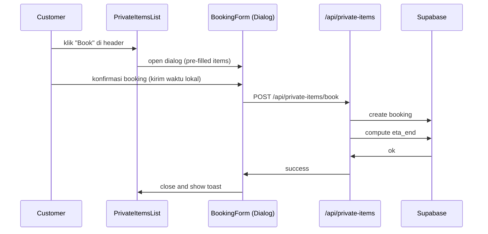
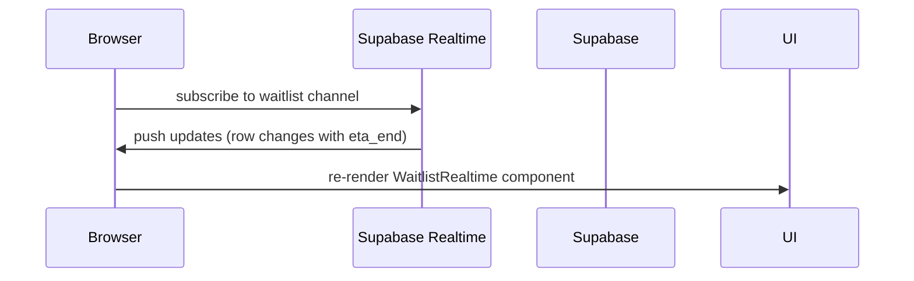
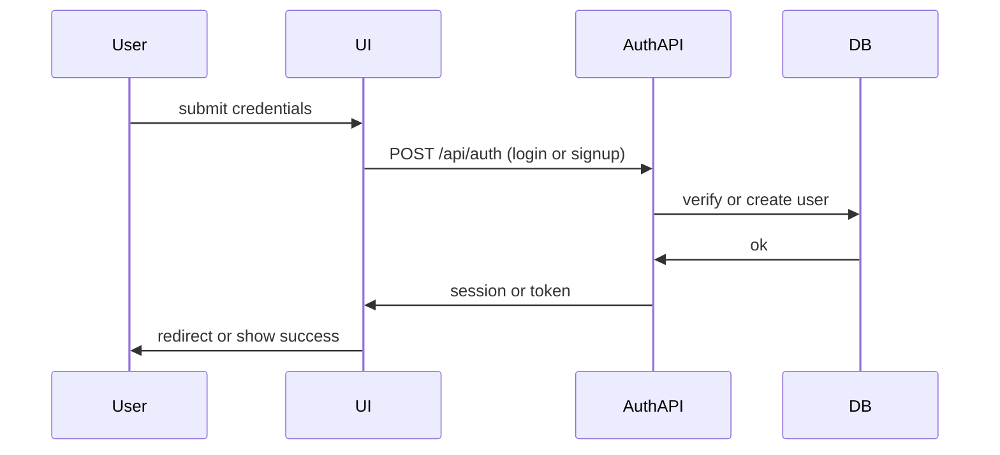

**README Diagram: Use Case & Sequence Diagrams**

Deskripsi singkat

- **Tujuan:** Dokumen ini menyediakan panduan, template, dan contoh untuk membuat Use Case dan Sequence Diagram untuk proyek `barber-apps`.
- **Format contoh:** Mermaid (mudah dirender di VS Code atau diekspor menjadi gambar menggunakan mermaid-cli).

**Diagrams Included**

- **Use Case Diagram:** gambaran aktor & fungsi utama (Booking, Waitlist, Authentication, Private Items management).
- **Sequence Diagrams:** skenario alur: Booking (standalone), Booking dari Private Items, Waitlist processing (realtime), dan Auth (login/signup).

**Mapping kode ↔ use cases**

- **Booking (UI):** `src/app/(dynamic-pages)/(main-pages)/(logged-in-pages)/dashboard/booking-form.tsx`
- **Private Items API & UI:** `src/app/api/private-items/route.ts`, `src/app/api/private-items/update/[id]/route.ts`, `src/app/(dynamic-pages)/(main-pages)/PrivateItemsList.tsx`
- **Waitlist (realtime):** `src/app/(dynamic-pages)/(main-pages)/waitlist/WaitlistRealtime.tsx`, `src/app/(dynamic-pages)/(main-pages)/waitlist/page.tsx`
- **Auth (login/signup):** `src/app/(dynamic-pages)/(login-pages)/(login-pages)/login/*` & `src/app/(dynamic-pages)/(login-pages)/(login-pages)/sign-up/*`
- **Data/durations:** `src/data/services.json` (dipakai server & client untuk menghitung ETA/durasi layanan)

**Use Case (ringkasan aktor & use cases)**

- **Aktor:** Customer, Staff, System
- **Use Cases Utama:**
  - **Browse Services** — customer melihat daftar layanan
  - **Create Booking** — customer membuat booking (dengan wall-clock lokal)
  - **Book From Private Items** — booking yang dipicu dari daftar private items
  - **Manage Private Items** — tambah / edit / delete private item
  - **Auth: Sign Up / Login** — otentikasi pengguna
  - **View Waitlist** — lihat antrean & ETA realtime

**Contoh Use Case (Mermaid)**



**Sequence Diagrams (template Mermaid & penjelasan)**

1. Booking — user memilih service dan submit



2. Booking via Private Items (Book from list)



3. Waitlist realtime — client menerima update ETA dari Supabase



4. Auth (login / signup)



**Rekomendasi struktur file diagram**

- `docs/diagrams/use-case.mmd`
- `docs/diagrams/booking.mmd`
- `docs/diagrams/private-items-booking.mmd`
- `docs/diagrams/waitlist.mmd`
- `docs/diagrams/auth.mmd`

**Cara merender / preview**

- VS Code: pasang ekstensi `vstirbu.vscode-mermaid-preview` atau `yzhang.mermaid-markdown-preview` untuk preview Mermaid di editor.
- CLI (rekomendasi pnpm): pasang `@mermaid-js/mermaid-cli` sebagai dev dependency dan render ke PNG/SVG.

Contoh (Windows `cmd.exe`):

```
pnpm add -D @mermaid-js/mermaid-cli
npx mmdc -i docs/diagrams/booking.mmd -o docs/diagrams/booking.png
```

Catatan: jika `mmdc` tidak ditemukan, jalankan `npx @mermaid-js/mermaid-cli -i <in> -o <out>` atau gunakan `npm`/`pnpm` sesuai preferensi.

**Tips & Best Practices**

- Konsistenkan format waktu di sequence: gunakan local wall-clock (`YYYY-MM-DDTHH:mm:ss`) ketika menggambarkan interaksi UI dan simpan di DB sebagai `timestamp without time zone` jika tujuan adalah mencatat waktu lokal yang dimasukkan user.
- Tandai pada diagram apabila ada asumsi (mis. fallback durasi 30 menit jika service tidak ditemukan).
- Sertakan referensi ke file kode di caption diagram saat commit (mis. `booking-form.tsx`, `private-items` API) supaya reviewer mudah menelusuri implementasi.

**Next steps (opsional yang bisa saya bantu)**

- Saya bisa membuat file Mermaid terpisah (`.mmd`) untuk tiap diagram.
- Saya bisa merender PNG/SVG untuk dimasukkan ke dokumentasi.
- Saya bisa menambahkan diagram ke README root atau ke wiki repo.

---

File ini dibuat sebagai titik awal. Jika Anda mau, saya bisa lanjut membuat file `.mmd` per diagram dan merendernya.
